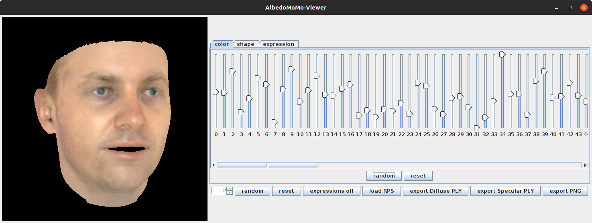
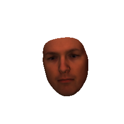
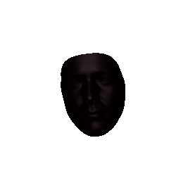

# Scala Software: Morphable Face Albedo Model

This is the Scala software to use the Morphable Face Albedo model.

# 0. Install requirements

## Requirements
- installed [Java](http://www.oracle.com/technetwork/java/javase/downloads/index.html) (Version 8.0 or higher recommended)
- installed [sbt](http://www.scala-sbt.org/release/tutorial/Setup.html) (only for compiling from sources)


# 1. Build Morphable Face Albedo Model

To build the Morphable Face Albedo Model you have to combine the albedo model with the Basel Face Model.

## Run (precompiled):
- download `assembly.jar` under [release](https://github.com/waps101/AlbedoMM/releases)
- download the Basel Face Model 2017 [here](https://faces.dmi.unibas.ch/bfm/bfm2017.html)
- download the Albedo Model [here](https://github.com/waps101/AlbedoMM/releases)
- download `assembly.jar` under [release](https://github.com/waps101/AlbedoMM/releases)
- put all the model files and the assembly.jar file into the same directory
- run `java -Xmx2g -cp assembly.jar faces.apps.AlbedoModelBuilder`
- the built model will be named `albedoModel2020_bfm.h5` and `albedoModel2020_face12.h5`


# 2. Simple Morphable Face Albedo Model Viewer
 
 Simple tool to view the Morphable Face Albedo Model.
 
 
 

## Run (precompiled):
- run `java -Xmx2g -cp assembly.jar faces.apps.AlbedoModelViewer`
- in the window that pops up choose the Morphable Face Albedo Model `albedoModel2020_bfm.h5` or `albedoModel2020_face12.h5` you have built in step 1.

## Usage:
- upper random and reset button will update color/shape/expression parameters for active tab
- lower random and reset button will update all model parameters
- the button neutralModel will remove the expression part of the model
- the button `load RPS` will load rendering parameters from a .rps file (currently only shape, color and expression)
- the button `write PLY` enables writing the current instance as a mesh in the ply file format (thanks to ImageSynthTue)
- the button `write PNG` enables writing the current instance as an image in the png file format
- sliders are ordered according to the principal components
- the maximal parameter value corresponding to the sliders can be adjusted
- press `Ctrl` to move pose with mouse (first click on face to activate the frame)


# 3. Inverse Rendering

FitScript from the [Basel Face Pipeline](https://github.com/unibas-gravis/basel-face-pipeline) adopted to the albedo model.

 
 
 
 

## Run (precompiled):
- run `java -Xmx2g -cp assembly.jar faces.apps.AlbedoModelFit`
- make sure, the model file is in the same directory as the jar, and the directory also contains the `fitting` subdirectory from the repository
- this will run the fitting for the image and langmark shipped in the `fitting` directory and will overwrite the results. 

We did not optimize any of the code for this task, so this is slower than the usual MCMC pipeline (multiple rendering steps per sample). If you want to learn more about the fitting pipeline we are using, we refer you to the [Tutorial on Probabilistic Fitting](https://gravis.dmi.unibas.ch/PMM/lectures/fitting/).

# General

If you find our work useful in your research, please cite:

```
@inproceedings{smith2020albedo,
    title={A Morphable Face Albedo Model},
    author={Smith, William A. P. and Seck, Alassane and Dee, Hannah and Tiddeman, Bernard and  Tenenbaum, Joshua and Egger, Bernhard},
    booktitle={Proc. {IEEE} Conference on Computer Vision and Pattern Recognition (CVPR)},
    year={2020}
}
```

For the usage of the Basel Face Model also cite:

```
@inproceedings{gerig18bfm,
    author={Thomas {Gerig} and Andreas {Morel-Forster} and Clemens {Blumer} and Bernhard {Egger} and Marcel {L{\"u}thi} and Sandro {Sch{\"o}nborn} and Thomas {Vetter}},
    booktitle={Proc. International Conference on Automatic Face and Gesture Recognition},
    title={Morphable Face Models - An Open Framework},
    year={2018},
}
```

For the inverse Rendering also cite:

```
@article{Schonborn2017,
    author="Sch{\"o}nborn, Sandro and Egger, Bernhard and Morel-Forster, Andreas and Vetter, Thomas",
    title="Markov Chain Monte Carlo for Automated Face Image Analysis",
    journal={International Journal of Computer Vision},
    year="2017",
    month="Jun",
    day="01",
    volume="123",
    number="2",
    pages="160--183",
    issn="1573-1405",
    doi="10.1007/s11263-016-0967-5",
    url="https://doi.org/10.1007/s11263-016-0967-5"
}
```
 
## Credit:
Those tools are derived from the [scalismo-faces](](https://github.com/unibas-gravis/scalismo-faces)) framework and its [applications](https://github.com/unibas-gravis/) which where developed at the University of Basel.


## For Developers:
- clone repository
- compile and run using `sbt run -mem 2000`

## Maintainer

- Bernhard Egger <egger.bernhard@gmail.com>

## Dependencies

- [scalismo-faces](https://github.com/unibas-gravis/scalismo-faces) `0.10.1+`
